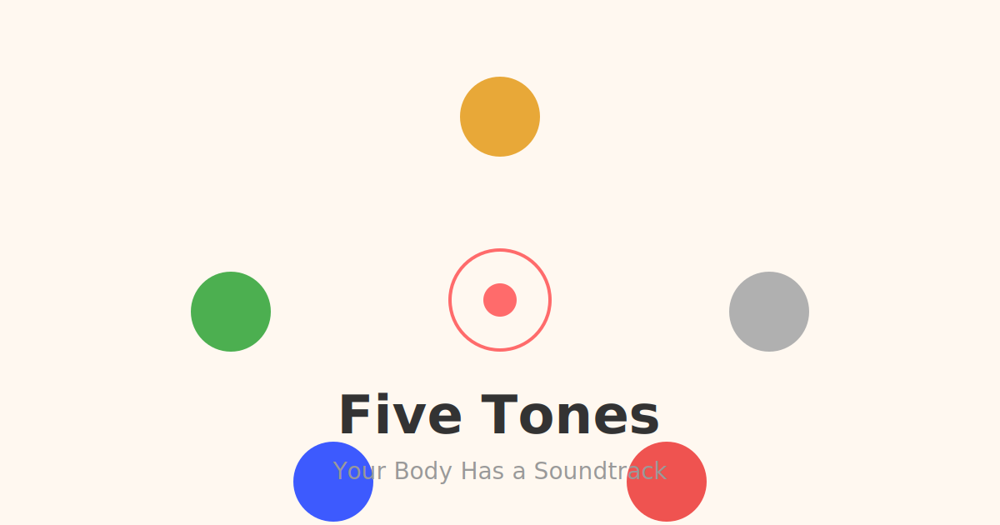

<p align="center">
  <picture>
    <source media="(prefers-color-scheme: dark)" srcset="public/og-image.svg">
    
  </picture>
</p>

<p align="center">
  <strong>Discover which of the five ancient Chinese healing tones your body is — and get a personalized Spotify playlist in 2 minutes.</strong>
</p>

<p align="center">
  <a href="https://fivetones.cc"><strong>fivetones.cc</strong></a> ·
  <a href="https://buymeacoffee.com/fivetones">Buy Me a Coffee</a> ·
  <a href="https://producthunt.com/products/five-tones">Product Hunt</a>
</p>

---

## What is Five Tones?

Five Tones blends a **2,000-year-old Chinese medicine framework** with modern music recommendation. Take a 2-minute diagnostic quiz, discover your constitution type, and get a curated Spotify playlist matched to your body's natural rhythm — plus a live **meridian clock** that shifts recommendations as the day progresses.

Built as a **PWA** — open the URL, take the quiz, add to home screen. No install, no signup, no permissions.

## How It Works

```
7-question TCM quiz  →  Constitution type  →  200 curated songs  →  Spotify playlist
                              │
                        Meridian Clock
                  (live organ-on-duty shifts
                   recommendations by time)
```

1. **Take the Quiz** — 7 questions across digestion, sleep, energy, emotions, and body signals, rooted in Five Element theory
2. **Discover Your Type** — One of six constitution types: The Grounded (Earth), The Clear (Metal), The Flowing (Wood), The Bright (Fire), The Deep (Water), or The Harmonized (Balanced)
3. **Get Your Playlist** — 6 songs picked for you: ~70% matched to your constitution, ~30% to the current meridian hour — with 200 hand-curated tracks across all genres
4. **Come Back Anytime** — The meridian clock reshuffles recommendations through the day. Different hour, different vibe.

### The Meridian Clock (子午流注)

A live display of the traditional Chinese organ clock — which meridian is "on duty" right now, and what kind of music supports it.

| Hour | Meridian | Vibe |
|------|----------|------|
| 23:00–01:00 | Gallbladder | Deep, restful |
| 01:00–03:00 | Liver | Gentle, flowing |
| 03:00–05:00 | Lungs | Clear, breathy |
| ... | ... | ... |

## Screenshots

| Home | Quiz | Result | Playlist |
|------|------|--------|----------|
| Five-tone halo + meridian clock | 7-question TCM diagnostic | Constitution reveal + score bars | Curated songs with pet-art covers |

> Screenshots will be added after Product Hunt launch (June 30, 2026).

## Tech Stack

| Layer | Technology |
|-------|------------|
| Framework | **Next.js 16** (App Router, static export) |
| UI | **React 19** + **Tailwind CSS 4** |
| Language | **TypeScript** |
| PWA | Service Worker + Web Manifest (offline-ready, installable) |
| Analytics | Self-hosted **GoatCounter** |
| Backend | **None** — pure static export, zero server |
| Auth | **None** — no signup, no permissions |
| Music | **Spotify** deep-links (opens Spotify search, no OAuth needed) |

### Why zero backend?

All quiz logic, song data, and recommendations run **client-side**. Results are stored in `localStorage`. The entire app is a static HTML/CSS/JS bundle that can be served from any web server, CDN, or even opened directly from disk.

## Deploy

```bash
npm install
npm run build      # outputs static files to out/
```

Serve `out/` from anywhere:

```bash
# One-liner: Python
python3 -m http.server 3000 -d out/

# Nginx
cp -r out/* /var/www/fivetones/

# Vercel / Netlify / Cloudflare Pages — drag and drop
```

This repo auto-deploys to [fivetones.cc](https://fivetones.cc) on every push to `master` via GitHub Actions.

## Project Structure

```
app/
├── page.tsx                  # Homepage (halo + meridian clock)
├── layout.tsx                # Root layout (OG tags, PWA, analytics)
├── quiz/page.tsx             # 7-question quiz
├── result/page.tsx           # Results + playlist
└── components/
    ├── ConstitutionHalo.tsx   # Animated five-element orbital
    ├── ConstitutionIcon.tsx   # SVG constitution icons
    ├── FiveTonesLogo.tsx      # Pentagon dot logo
    └── TaijiIcon.tsx          # Yin-Yang symbol

lib/
├── constitutions.ts          # 6 constitution types + scoring
├── questions.ts              # 7 diagnostic questions + engine
├── songs.ts                  # 200 curated songs
└── shichen.ts                # 12-period meridian clock

public/
├── covers/                   # 200+ pet photos (album art)
└── sw.js                     # PWA service worker
```

## Why This Exists

The idea came from **音为你 (YinWeiNi)**, a WeChat Mini Program built for the Chinese market with ~200 daily users. Five Tones is its global sibling — same TCM diagnostic core, rebuilt for the open web with English UX, Spotify integration, and zero-platform lock-in.

No one has combined **TCM constitution diagnosis + music recommendation + product**. The closest competitors do one of the three. Five Tones does all three in a single PWA.

## Disclaimer

**For entertainment & wellness only. Not medical advice.** Five Tones uses a 2,000-year-old diagnostic framework. It is not a substitute for professional medical diagnosis or treatment.

## Maker

Built by [@dali-321](https://github.com/dali-321) — TCM practitioner turned builder.

- 🎵 **Five Tones** — you're looking at it
- 📱 **音为你** — WeChat Mini Program (200+ daily users, Chinese market)
- ☕ [Buy Me a Coffee](https://buymeacoffee.com/fivetones)

---

<p align="center">
  <sub>MIT License · Made with Claude Code · Deployed on a $99/year HK VPS</sub>
</p>
